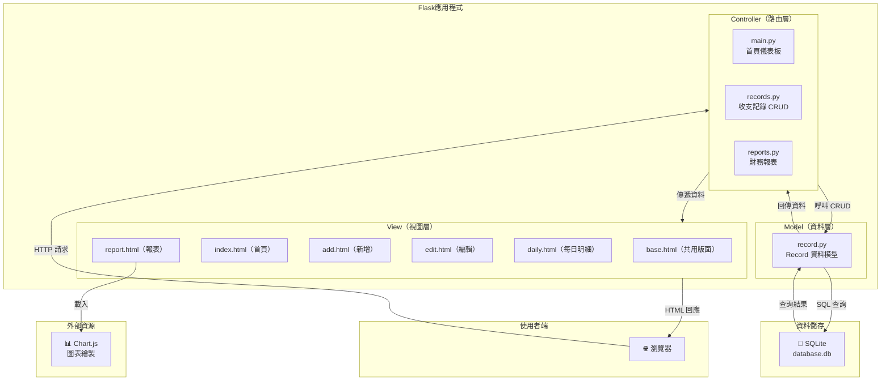
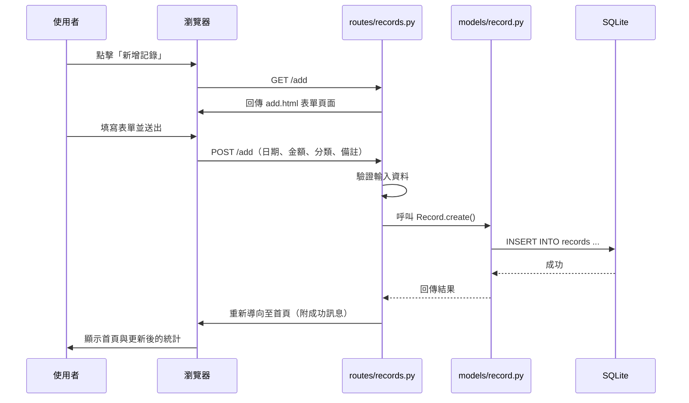

# 系統架構文件 — 個人記帳簿系統

## 1. 技術架構說明

### 1.1 選用技術與原因

| 技術             | 用途             | 選用原因                                                       |
| ---------------- | ---------------- | -------------------------------------------------------------- |
| **Python**       | 程式語言         | 語法簡潔、易學，適合快速開發 Web 應用                          |
| **Flask**        | 後端框架         | 輕量級微框架，彈性高、學習曲線低，適合中小型專案               |
| **Jinja2**       | 模板引擎         | Flask 內建支援，可直接在 HTML 中嵌入 Python 邏輯來渲染頁面     |
| **SQLite**       | 資料庫           | 檔案型資料庫，無需額外安裝伺服器，適合個人應用與開發階段       |
| **HTML/CSS/JS**  | 前端             | 標準網頁技術，搭配 Jinja2 進行伺服器端渲染（SSR）             |
| **Chart.js**     | 圖表庫           | 開源、輕量，支援多種圖表類型，適合製作財務報表視覺化           |

### 1.2 Flask MVC 模式說明

本專案採用 **MVC（Model-View-Controller）** 架構模式，將程式碼依職責分為三層：

```
┌─────────────────────────────────────────────────────────┐
│                      使用者（瀏覽器）                     │
└────────────┬────────────────────────────┬───────────────┘
             │ HTTP 請求                   ▲ HTML 回應
             ▼                            │
┌─────────────────────────────────────────────────────────┐
│                  Controller（路由層）                     │
│                   app/routes/                            │
│                                                         │
│  • 接收使用者的 HTTP 請求（GET / POST）                   │
│  • 呼叫 Model 進行資料存取                                │
│  • 將結果傳給 View 渲染成 HTML                            │
└────────┬───────────────────────────────┬────────────────┘
         │ 資料操作                       │ 傳遞資料
         ▼                               ▼
┌────────────────────┐    ┌──────────────────────────────┐
│   Model（資料層）    │    │      View（視圖層）           │
│   app/models/       │    │      app/templates/          │
│                     │    │                              │
│ • 定義資料結構       │    │ • Jinja2 HTML 模板           │
│ • 與 SQLite 互動    │    │ • 接收 Controller 傳來的資料  │
│ • CRUD 操作         │    │ • 渲染成使用者看到的頁面      │
└────────┬────────────┘    └──────────────────────────────┘
         │ SQL 查詢
         ▼
┌─────────────────────┐
│   SQLite 資料庫      │
│   instance/         │
│   database.db       │
└─────────────────────┘
```

**各層職責簡述：**

| 層級           | 位置               | 職責                                       |
| -------------- | ------------------ | ------------------------------------------ |
| **Model**      | `app/models/`      | 定義資料結構、封裝資料庫的增刪改查（CRUD）   |
| **View**       | `app/templates/`   | 用 Jinja2 模板將資料渲染成 HTML 頁面         |
| **Controller** | `app/routes/`      | 接收請求、處理商業邏輯、協調 Model 與 View   |

---

## 2. 專案資料夾結構

```
web_app_development/
│
├── app.py                     ← 應用程式入口，啟動 Flask 伺服器
├── config.py                  ← 設定檔（資料庫路徑、密鑰等）
├── requirements.txt           ← Python 相依套件清單
├── README.md                  ← 專案說明文件
│
├── app/                       ← 主要應用程式目錄
│   ├── __init__.py            ← Flask App 工廠函式（create_app）
│   │
│   ├── models/                ← Model 層：資料庫模型
│   │   ├── __init__.py
│   │   └── record.py          ← 收支記錄的資料模型（CRUD 操作）
│   │
│   ├── routes/                ← Controller 層：路由與商業邏輯
│   │   ├── __init__.py
│   │   ├── main.py            ← 首頁（儀表板）路由
│   │   ├── records.py         ← 新增/編輯/刪除收支記錄路由
│   │   └── reports.py         ← 財務報表路由
│   │
│   ├── templates/             ← View 層：Jinja2 HTML 模板
│   │   ├── base.html          ← 共用版面（導覽列、頁尾、CSS/JS 引入）
│   │   ├── index.html         ← 首頁儀表板（總收入/總支出/結餘）
│   │   ├── add.html           ← 新增收支記錄表單
│   │   ├── edit.html          ← 編輯收支記錄表單
│   │   ├── daily.html         ← 每日收支明細
│   │   └── report.html        ← 財務報表頁面（圖表）
│   │
│   └── static/                ← 靜態資源
│       ├── css/
│       │   └── style.css      ← 全站樣式表
│       └── js/
│           └── main.js        ← 前端 JavaScript（圖表、互動邏輯）
│
├── instance/                  ← 實例資料夾（不納入版本控制）
│   └── database.db            ← SQLite 資料庫檔案
│
└── docs/                      ← 專案文件
    ├── PRD.md                 ← 產品需求文件
    └── ARCHITECTURE.md        ← 本檔案：系統架構文件
```

### 各資料夾／檔案用途說明

| 路徑                    | 說明                                                         |
| ----------------------- | ------------------------------------------------------------ |
| `app.py`                | 程式進入點，呼叫 `create_app()` 並啟動 Flask 開發伺服器       |
| `config.py`             | 集中管理設定（如資料庫路徑 `SQLITEDB`、`SECRET_KEY`）         |
| `app/__init__.py`       | Flask 應用工廠，初始化 app、註冊 Blueprint、建立資料庫         |
| `app/models/record.py`  | 定義 `Record` 類別，封裝對 `records` 資料表的 CRUD 操作       |
| `app/routes/main.py`    | 處理 `/` 首頁路由，查詢並計算總收入、總支出、結餘              |
| `app/routes/records.py` | 處理 `/add`、`/edit/<id>`、`/delete/<id>` 等收支記錄操作       |
| `app/routes/reports.py` | 處理 `/report` 路由，查詢統計資料並傳給圖表模板                |
| `app/templates/base.html` | 所有頁面的共用模板，包含導覽列、頁尾、CSS/JS 引入            |
| `app/static/`           | 存放 CSS 樣式表、JavaScript 檔案等靜態資源                     |
| `instance/database.db`  | SQLite 資料庫實際檔案，由 Flask 自動管理                       |

---

## 3. 元件關係圖

以下使用 Mermaid 語法呈現系統元件之間的互動關係：



### 請求處理流程（以「新增一筆支出」為例）



---

## 4. 關鍵設計決策

### 決策一：使用 Flask Application Factory 模式

**選擇：** 在 `app/__init__.py` 中使用 `create_app()` 工廠函式建立 Flask 應用。

**原因：**
- 方便管理不同環境的設定（開發 / 測試 / 正式）
- 避免循環匯入（circular import）問題
- 是 Flask 官方推薦的最佳實踐

### 決策二：使用 Blueprint 組織路由

**選擇：** 將路由分成 `main`、`records`、`reports` 三個 Blueprint。

**原因：**
- 將不同功能的路由分開管理，程式碼更清晰
- 每個 Blueprint 獨立負責一個功能模組，降低耦合度
- 未來新增功能時只需新增 Blueprint，不影響現有程式碼

### 決策三：使用原生 sqlite3 而非 ORM

**選擇：** 使用 Python 內建的 `sqlite3` 模組直接操作資料庫，而非使用 SQLAlchemy 等 ORM。

**原因：**
- 減少額外相依套件，保持專案簡潔
- 直接撰寫 SQL 有助於學習資料庫操作
- 對於小型專案，原生 SQL 已足夠且效能更佳

### 決策四：伺服器端渲染（SSR）而非前後端分離

**選擇：** 使用 Flask + Jinja2 在伺服器端渲染完整 HTML 頁面，不使用前後端分離架構。

**原因：**
- 降低技術複雜度，不需要額外的前端框架（如 React、Vue）
- 適合初學者理解 Web 開發的基本流程
- 對於記帳簿這類 CRUD 應用，SSR 已能滿足所有需求

### 決策五：Chart.js 作為圖表繪製工具

**選擇：** 使用 Chart.js CDN 載入，在前端繪製財務報表圖表。

**原因：**
- 開源免費，社群活躍，文件完整
- 支援圓餅圖與折線圖，正好符合財務報表的需求
- 透過 CDN 載入，無需打包工具，保持專案簡單
