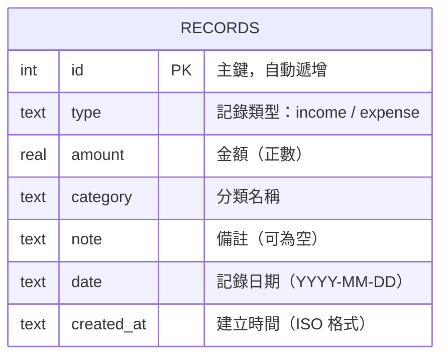

# 資料庫設計文件 — 個人記帳簿系統

## 1. ER 圖（實體關係圖）

本系統為單一使用者的個人記帳簿，目前只有一個主要資料表 `records`，用於儲存所有收入與支出記錄。



> **設計說明：** 由於本系統為個人記帳簿（無多使用者需求），因此不需要 `users` 資料表。收入與支出共用同一張 `records` 資料表，以 `type` 欄位區分。

---

## 2. 資料表詳細說明

### records 資料表

用於儲存所有的收入與支出記錄。

| 欄位名稱     | 資料型別  | 必填 | 預設值              | 說明                                           |
| ------------ | --------- | ---- | ------------------- | ---------------------------------------------- |
| `id`         | INTEGER   | 自動 | AUTOINCREMENT       | 主鍵（Primary Key），自動遞增                   |
| `type`       | TEXT      | ✅   | —                   | 記錄類型：`income`（收入）或 `expense`（支出）  |
| `amount`     | REAL      | ✅   | —                   | 金額，必須為正數                                |
| `category`   | TEXT      | ✅   | —                   | 分類名稱（如：餐飲、薪資等）                    |
| `note`       | TEXT      | ❌   | `''`（空字串）      | 備註說明，可為空                                |
| `date`       | TEXT      | ✅   | 當天日期            | 記錄日期，格式為 `YYYY-MM-DD`                   |
| `created_at` | TEXT      | 自動 | 當前時間            | 記錄建立時間，ISO 8601 格式                     |

**Primary Key：** `id`

**索引：**
- `idx_records_date` — 加速依日期查詢
- `idx_records_type` — 加速依類型篩選
- `idx_records_category` — 加速分類統計

**分類預設值：**

| 類型       | 預設分類                                           |
| ---------- | -------------------------------------------------- |
| 收入       | 薪資、獎金、兼職、投資收益、其他                   |
| 支出       | 餐飲、交通、娛樂、購物、日用品、醫療、教育、其他   |

---

## 3. SQL 建表語法

完整的 SQL 建表語法請參見 [`database/schema.sql`](../database/schema.sql)。

```sql
-- 建立 records 資料表
CREATE TABLE IF NOT EXISTS records (
    id         INTEGER PRIMARY KEY AUTOINCREMENT,
    type       TEXT    NOT NULL CHECK(type IN ('income', 'expense')),
    amount     REAL    NOT NULL CHECK(amount > 0),
    category   TEXT    NOT NULL,
    note       TEXT    DEFAULT '',
    date       TEXT    NOT NULL,
    created_at TEXT    DEFAULT (datetime('now', 'localtime'))
);

-- 建立索引
CREATE INDEX IF NOT EXISTS idx_records_date     ON records(date);
CREATE INDEX IF NOT EXISTS idx_records_type     ON records(type);
CREATE INDEX IF NOT EXISTS idx_records_category ON records(category);
```

---

## 4. Python Model 程式碼

Model 檔案位於 `app/models/record.py`，使用原生 `sqlite3` 模組，提供以下 CRUD 方法：

| 方法                              | 說明                                     |
| --------------------------------- | ---------------------------------------- |
| `Record.create()`                 | 新增一筆收支記錄                         |
| `Record.get_all()`                | 取得所有記錄                             |
| `Record.get_by_id(id)`            | 依 ID 取得單筆記錄                       |
| `Record.get_by_date(date)`        | 依日期取得當天所有記錄                   |
| `Record.update(id, ...)`          | 更新指定記錄                             |
| `Record.delete(id)`               | 刪除指定記錄                             |
| `Record.get_summary(month)`       | 取得指定月份的總收入、總支出、結餘       |
| `Record.get_expense_by_category(month)` | 取得指定月份各分類的支出統計       |
| `Record.get_daily_summary(month)` | 取得指定月份每日的收支統計               |

詳細實作請參見 [`app/models/record.py`](../app/models/record.py)。
