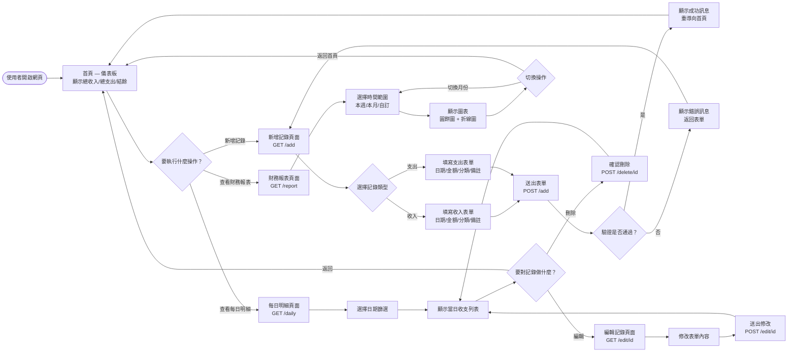
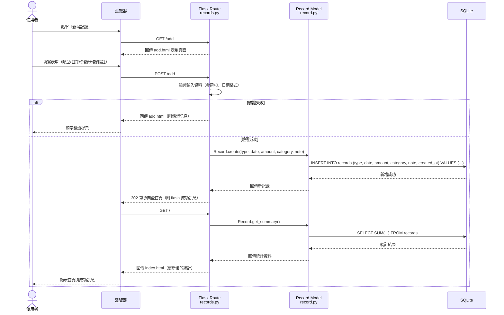
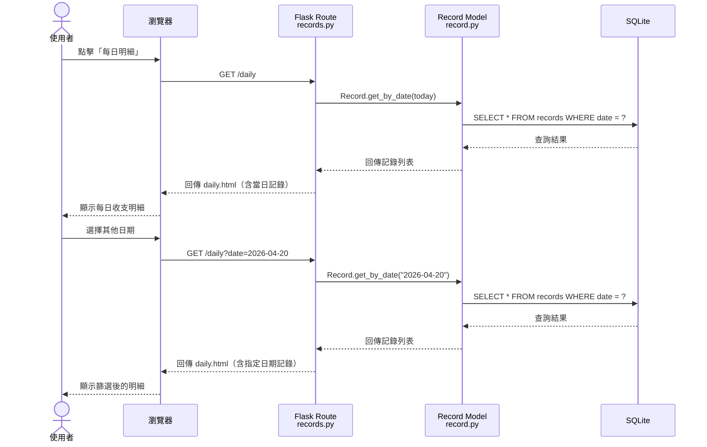
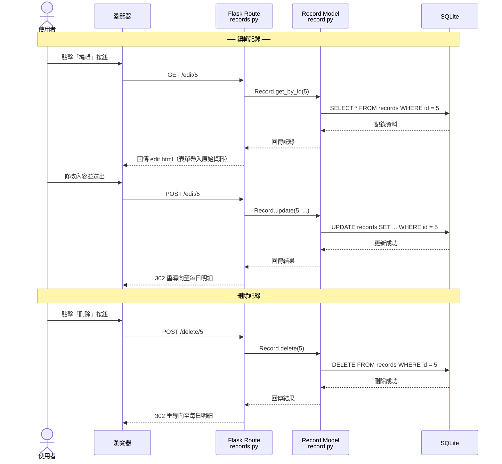
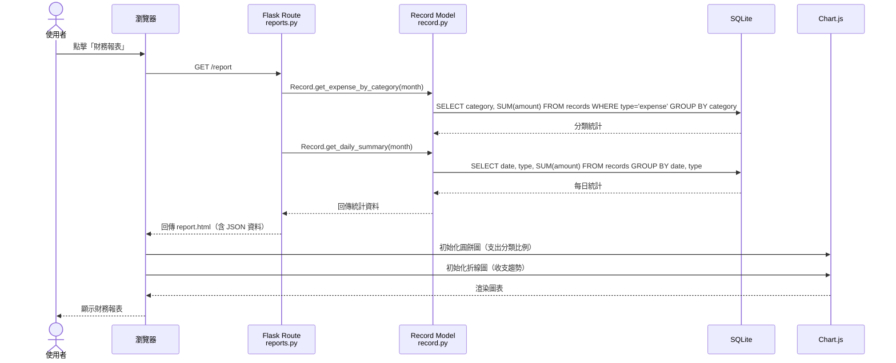

# 流程圖文件 — 個人記帳簿系統

## 1. 使用者流程圖（User Flow）

以下流程圖展示使用者從進入網站到完成各項操作的完整路徑：

### 流程說明

1. **首頁（儀表板）**：使用者進入系統後，立即看到總收入、總支出與結餘三大數字
2. **新增記錄**：選擇收入或支出 → 填寫表單 → 驗證 → 成功後回到首頁
3. **每日明細**：選擇日期 → 瀏覽當天記錄 → 可編輯或刪除個別項目
4. **財務報表**：選擇時間範圍 → 查看支出圓餅圖與收支趨勢折線圖

---

## 2. 系統序列圖（Sequence Diagram）

### 2.1 新增收支記錄

### 2.2 查看每日收支明細

### 2.3 編輯與刪除記錄

### 2.4 查看財務報表

---

## 3. 功能清單對照表

| #  | 功能             | URL 路徑          | HTTP 方法    | Controller          | 說明                              |
| -- | ---------------- | ----------------- | ------------ | ------------------- | --------------------------------- |
| 1  | 首頁儀表板       | `/`               | `GET`        | `routes/main.py`    | 顯示總收入、總支出、結餘          |
| 2  | 新增記錄（頁面） | `/add`            | `GET`        | `routes/records.py` | 顯示新增收支記錄的表單            |
| 3  | 新增記錄（送出） | `/add`            | `POST`       | `routes/records.py` | 處理表單送出，新增記錄至資料庫    |
| 4  | 每日收支明細     | `/daily`          | `GET`        | `routes/records.py` | 依日期顯示收支明細，支援日期篩選  |
| 5  | 編輯記錄（頁面） | `/edit/<id>`      | `GET`        | `routes/records.py` | 顯示編輯表單（帶入原始資料）      |
| 6  | 編輯記錄（送出） | `/edit/<id>`      | `POST`       | `routes/records.py` | 處理修改並更新資料庫              |
| 7  | 刪除記錄         | `/delete/<id>`    | `POST`       | `routes/records.py` | 刪除指定記錄                      |
| 8  | 財務報表         | `/report`         | `GET`        | `routes/reports.py` | 顯示支出分類圓餅圖與收支趨勢圖   |
